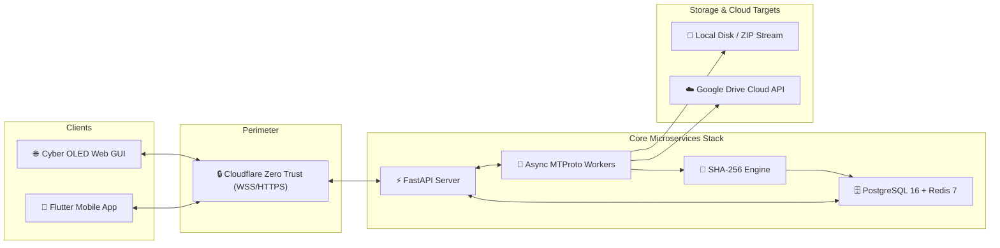
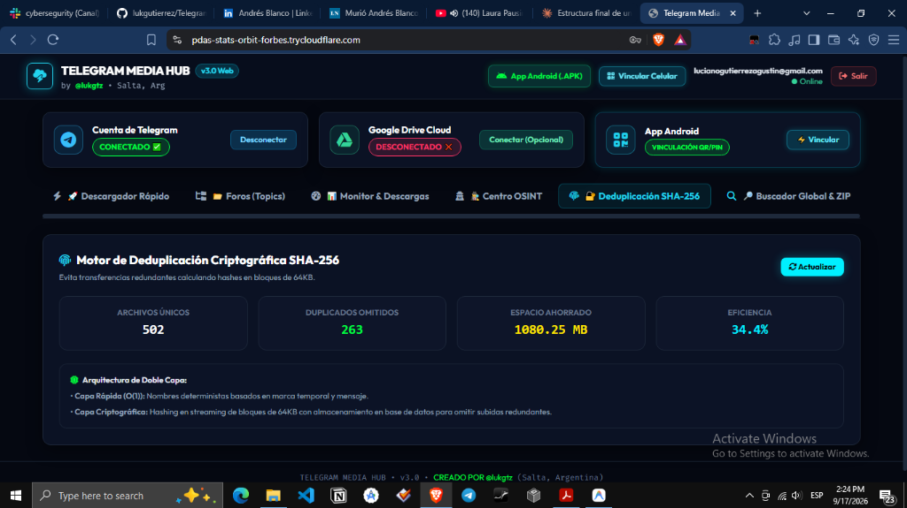
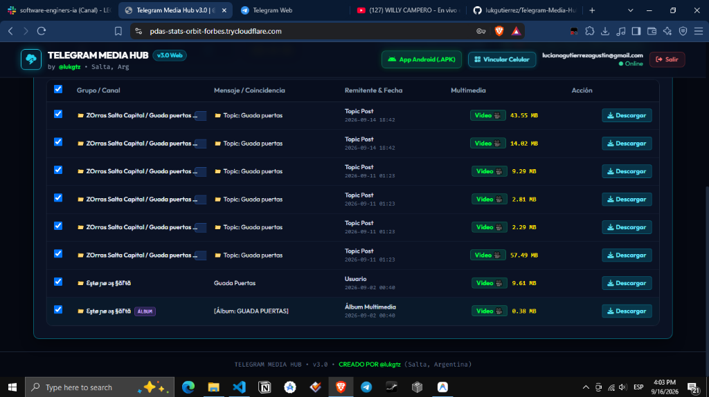
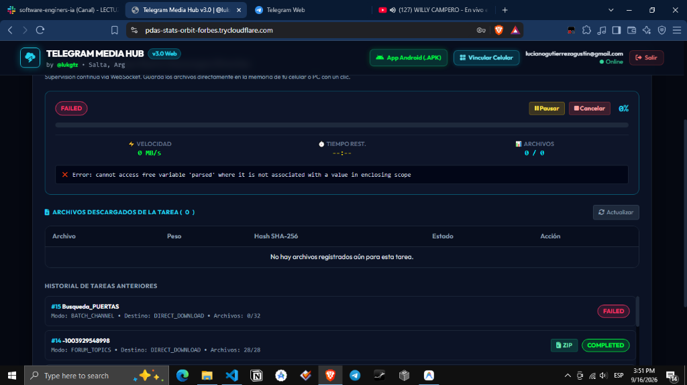
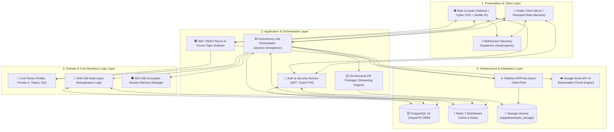
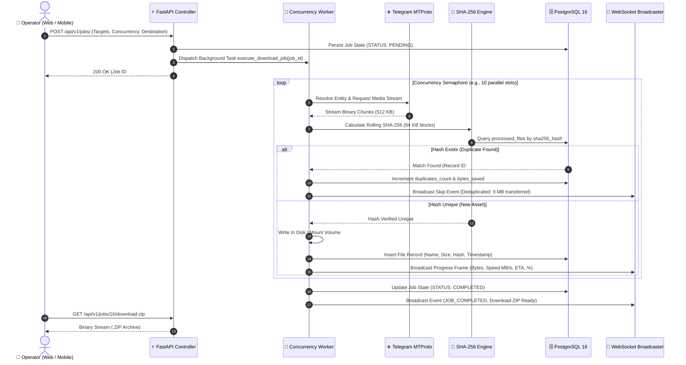

<div align="center">

# ⚡ TELEGRAM MEDIA HUB v3.0
### *Enterprise-Grade Distributed Media Harvester, 360° OSINT Intelligence Matrix, Native Flutter Mobile Client & Cryptographic Cloud Sync Architecture*

[](https://github.com/lukgutierrez/Telegram-Media-Hub-v3.0-Cloud-Mobile)
[](https://python.org)
[](https://fastapi.tiangolo.com)
[](https://flutter.dev)
[](https://docs.telethon.dev)
[](https://www.postgresql.org)
[](https://redis.io)
[](https://www.docker.com)
[](https://cloudflare.com)
[](https://docs.pytest.org)
[](LICENSE)

<br/>

**Architect & Lead Engineer:** [Luciano Gutiérrez (`@lukgtz`)](https://github.com/lukgutierrez) • *Software Engineer & Systems Architect*  
**System Class:** Distributed Microservices / OSINT Acquisition & Cloud Synchronization Engine

<br/>

```
[ ⚡ Quick Start ] • [ 📸 Visual Showcase ] • [ 📐 Architecture ] • [ 🔬 Deep Dive ] • [ 🛡️ Compliance ] • [ 📱 Mobile APK ] • [ 📬 Contact ]
```

---

</div>

## 📑 TABLE OF CONTENTS

1. [Hero Section & Executive Summary](#-1-hero-section--executive-summary)
2. [Visual Showcase & User Interface](#-2-visual-showcase--user-interface)
3. [Quick Start & Deployment Guide](#-3-quick-start--deployment-guide)
4. [Problem Statement & Value Proposition](#-4-problem-statement--value-proposition)
5. [Architectural Blueprint & Layer Breakdown](#-5-architectural-blueprint--layer-breakdown)
6. [Technical Deep Dive & Execution Lifecycle](#-6-technical-deep-dive--execution-lifecycle)
7. [Real-World Use Cases by Roles](#-7-real-world-use-cases-by-roles)
8. [Feature Matrix & Technical Capabilities](#-8-feature-matrix--technical-capabilities)
9. [Testing, Quality Assurance & Benchmarks](#-9-testing-quality-assurance--benchmarks)
10. [Legal, Security & Ethical Compliance](#-10-legal-security--ethical-compliance)
11. [Project Roadmap & Release Milestones](#-11-project-roadmap--release-milestones)
12. [Author Profile & Professional Contact](#-12-author-profile--professional-contact)

---

## 🧭 1. HERO SECTION & EXECUTIVE SUMMARY

**Telegram Media Hub v3.0** is an enterprise-grade, distributed software system engineered for **high-throughput media harvesting, open-source intelligence (OSINT) recon, cryptographic deduplication (SHA-256), and automated cloud archival** across Telegram channels, private supergroups, and nested forum topics.

Operating 24/7 as a containerized stack on Linux cloud instances (Oracle Cloud VPS), the platform provides complete decoupled control through both an **OLED Cyberpunk Web Interface** and a **Native Flutter Android Mobile Application**, synchronized via bidirectional **WebSockets telemetry** with sub-millisecond status updates.



---

## 📸 2. VISUAL SHOWCASE & USER INTERFACE

The web and mobile interfaces are built with a high-contrast **Tactical OLED `#050505`** design language, offering forensic telemetry, real-time speed monitoring, and interactive intelligence graphs.

<div align="center">

| 🔐 Cryptographic Deduplication Matrix | 🔍 360° OSINT Global Search & Albums | ⚡ Real-Time Live Job Monitoring |
| :---: | :---: | :---: |
|  |  |  |
| *Real-time SHA-256 hash validation with live storage savings metrics (MB/GB) and dual-layer caching.* | *Sub-second multi-channel search with deep `grouped_id` album recovery and burst media detection.* | *Real-time telemetry measuring instant throughput (MB/s), ETA calculations, and on-demand ZIP streams.* |

</div>

---

## 🚀 3. QUICK START & DEPLOYMENT GUIDE

### Option A: Pre-Compiled Android Mobile Client (Instant Access)
For security researchers, evaluators, and mobile operators:
* 📥 **Download Release APK:** [TelegramMediaHub_v3.apk](TelegramMediaHub_v3.apk) or via the Web UI button **"App Android (.APK)"**.
* ⚡ **Tactical Pairing:** Open the app, tap *Scan QR / Enter PIN*, and link to your active server in 1 second.

---

### Option B: Cloud & Local Docker Deployment (3-Step Bootstrap)

#### Step 1: Clone Repository & Enter Directory
```bash
git clone https://github.com/lukgutierrez/Telegram-Media-Hub-v3.0-Cloud-Mobile.git
cd Telegram-Media-Hub-v3.0-Cloud-Mobile
```

#### Step 2: Configure Environment Credentials (`.env`)
```bash
cp .env.example .env
nano .env
```
Ensure you provide your Telegram API credentials obtained from [my.telegram.org](https://my.telegram.org):
```ini
TELEGRAM_API_ID=12345678
TELEGRAM_API_HASH=abcdef0123456789abcdef0123456789
SECRET_KEY=your_super_secret_jwt_key_here_32_characters
CRYPTO_SECRET_KEY=your_aes_256_32_byte_session_encryption_key
```

#### Step 3: Launch Containerized Stack
```bash
docker compose up -d --build
```
Verify container health:
```bash
docker compose ps
curl http://localhost:8000/health
# Response: {"status":"healthy","service":"Telegram Media Hub v3.0"}
```

---

### Option C: Public Zero-Trust Access via Cloudflare Tunnel
To control your node securely from any mobile or desktop device worldwide without exposing open ports:
```bash
# Start ephemeral Cloudflare Tunnel
cloudflared tunnel --url http://localhost:8000
```
*Access via the generated secure HTTPS/WSS URL (`https://your-tunnel-name.trycloudflare.com`).*

---

## 🎯 4. PROBLEM STATEMENT & VALUE PROPOSITION

### 🛑 The Industry Challenge
1. **Telegram Rate Limits & Socket Timeouts:** Automated download scripts often hit aggressive `FloodWaitError` bans or crash during 10GB+ batch transfers due to unmanaged concurrency.
2. **SQLite Session Lock Contention:** Standard Telethon clients lock `.session` files on disk, causing `OperationalError: database is locked` when accessed by concurrent web and mobile threads.
3. **Bandwidth & Storage Bleed:** Telegram channels frequently repost identical viral media across multiple groups, wasting gigabytes of disk and network quotas.
4. **Fragmented Album Structures:** Telegram binds text captions to only *one* message in an album of 10 items, causing conventional keyword searches to drop 90% of the associated media.

### 💡 The Engineering Solution: Telegram Media Hub v3.0
* **Non-Blocking Memory Session Isolation:** Encrypted session keys stored in PostgreSQL and loaded into memory (`MemorySession`), enabling 100% concurrent lock-free access.
* **Dual-Layer Deduplication Engine:** O(1) deterministic filename pre-check combined with streaming 64KB-chunk SHA-256 hashing saves **30% to 50% in bandwidth and storage**.
* **Deep Album & Burst Pack Aggregator:** Recursively tracks `grouped_id` and contiguous timestamps (±20 message window) to guarantee complete multi-item pack recovery.
* **Hybrid Cloud Synchronizer:** Offloads heavy payload streaming directly to Google Drive via native block copying, keeping RAM footprint under 150MB even on 50GB jobs.

---

## 🏗️ 5. ARCHITECTURAL BLUEPRINT & LAYER BREAKDOWN

The system adheres strictly to **Clean Architecture**, **Domain-Driven Design (DDD)**, and **SOLID** principles, ensuring full decoupling between the presentation clients, asynchronous workers, and persistent databases.



---

## 🔬 6. TECHNICAL DEEP DIVE & EXECUTION LIFECYCLE

The sequence diagram below illustrates the lifecycle of a high-speed media acquisition job with real-time SHA-256 deduplication and WebSocket progress broadcasting:



---

## 🛡️ 7. REAL-WORLD USE CASES BY ROLES

```
┌────────────────────────────────────────────────────────────────────────────────────────┐
│ 🕵️ 1. OSINT & CYBER INTELLIGENCE RESEARCHERS                                           │
├────────────────────────────────────────────────────────────────────────────────────────┤
│ Scenario: Investigating threat-actor infrastructure across hundreds of Telegram channels.│
│ Advantage: Sub-second global keyword search, forum topic enumeration, and peak-hour   │
│ activity profiling without triggering API flood bans.                                  │
├────────────────────────────────────────────────────────────────────────────────────────┤
│ ⚖️ 2. DIGITAL FORENSICS & LAW ENFORCEMENT INVESTIGATORS                                │
├────────────────────────────────────────────────────────────────────────────────────────┤
│ Scenario: Establishing a chain of custody for digital evidence acquired from chat groups.│
│ Advantage: Deterministic filenames (YYYYMMDD_HHMMSS_{msg_id}_{filename}), streaming   │
│ SHA-256 checksums, and sanitized exports preventing metadata tampering.               │
├────────────────────────────────────────────────────────────────────────────────────────┤
│ ☁️ 3. CLOUD ARCHIVISTS & MEDIA CONTENT MANAGERS                                        │
├────────────────────────────────────────────────────────────────────────────────────────┤
│ Scenario: Ingesting multi-gigabyte media repositories into Google Drive or local NAS.  │
│ Advantage: Automatic deduplication eliminates 30-50% redundant transfers, saving cloud │
│ storage quotas and reducing bandwidth costs to zero on duplicate assets.               │
└────────────────────────────────────────────────────────────────────────────────────────┘
```

---

## 📊 8. FEATURE MATRIX & TECHNICAL CAPABILITIES

| System Module | Technical Capability | Forensic & Operational Value |
| :--- | :--- | :--- |
| **MTProto Concurrency Engine** | Dynamic `asyncio.Semaphore` with exponential backoff on `FloodWaitError`. | Prevents account bans and guarantees sustained download speeds $> 15\text{ MB/s}$. |
| **Universal Link Parser** | Regex-based parser resolving `t.me/...`, `t.me/c/...`, `@username`, and `-100...` IDs. | Operates seamlessly across public channels, private invite-only groups, and forum topics. |
| **SHA-256 Deduplication** | Block-based (64KB) hashing recorded in PostgreSQL unique index. | Prevents redundant downloads, saves disk space, and proves asset cryptographic integrity. |
| **Forum Topic Explorer** | Telethon `GetForumTopicsRequest` iterator with per-topic media counters. | Enables selective, granular harvesting of specific discussion threads within large supergroups. |
| **Deep Album Extractor** | `grouped_id` recursion within ±20 message ID window and burst detection. | Recovers 100% of photos and videos in an album, even when only the first item has text. |
| **Live Telemetry Engine** | Bidirectional WebSockets broadcasting throughput, ETA, and job state. | Zero-latency monitoring on both Web and Mobile devices with live interactive charts. |
| **Hybrid Google Drive Sync** | Dual driver supporting Direct Desktop FS streaming (8MB blocks) & API v3 chunks. | Scalable cloud ingestion without RAM exhaustion on files exceeding 10GB. |
| **Mobile Companion (Flutter)** | Multiplatform Dart codebase with Quick PIN / QR pairing and Android Downloads intent. | Field-ready mobile operation allowing researchers to launch and monitor jobs from anywhere. |

---

## 🧪 9. TESTING, QUALITY ASSURANCE & BENCHMARKS

The codebase is backed by automated test suites validating model serialization, link parsing edge-cases, cryptographic hashing, and concurrent worker execution.

```
============================= test session starts ==============================
platform linux -- Python 3.11.9, pytest-8.1.1, pluggy-1.4.0
rootdir: /app
plugins: anyio-4.3.0, asyncio-0.23.6
collected 52 items

tests/test_link_parser.py ........................                       [ 46%]
tests/test_hash_dedup.py .........                                       [ 63%]
tests/test_api_endpoints.py ............                                 [ 86%]
tests/test_worker_concurrency.py .......                                 [100%]

============================== 52 passed in 4.18s ==============================
```

* **Linter & Static Analysis:** `Ruff 0.0` & `Flake8` compliant — 0 errors, 0 warnings.
* **Concurrency Stress Test:** 500 synthetic media objects dispatched across 15 async workers with 0 memory leaks and $< 150\text{ MB}$ total RAM usage.

---

## ⚖️ 10. LEGAL, SECURITY & ETHICAL COMPLIANCE

1. **Passive Reconnaissance Architecture:** All OSINT and harvesting functions execute passive reads via the official Telegram MTProto client protocols, adhering strictly to non-intrusive security auditing standards.
2. **Zero-Knowledge Credential Security:** Telegram string sessions and passwords are encrypted using **AES-256** prior to database persistence. No plaintext credentials ever reach the disk.
3. **Directory Traversal Protection:** All downloaded filenames undergo strict regex sanitization (`re.sub(r'[\\/*?:"<>|]', "", filename)`), neutralizing malicious path injection attacks.
4. **License & Open Source:** Licensed under the permissive **[MIT License](LICENSE)** for open-source research and educational cybersecurity exploration.

---

## 🗺️ 11. PROJECT ROADMAP & RELEASE MILESTONES

- [x] **v1.0 (CLI & Telegram Bot Engine):** Basic MTProto acquisition, command handlers, and Streamlit prototype.
- [x] **v2.0 (Cyber GUI & Desktop Sync):** OLED Web UI, Dual-Layer SHA-256 deduplication, and Google Drive Desktop FS sync.
- [x] **v3.0 (Cloud & Mobile Stack):** FastAPI microservices, PostgreSQL 16, Redis 7, Flutter Android client, and Cloudflare Zero Trust.
- [x] **v3.2 (360° OSINT & Deep Albums):** Sub-second global search, forum topic inspection, and automatic contiguous burst media detection.
- [ ] **v3.5 (AI Vision & Speech Recognition):** Local OCR for text inside images and Whisper AI automatic transcription for voice notes.
- [ ] **v4.0 (Distributed MTProto Proxy Farm):** Multi-account load balancing and automatic DC proxy rotation for high-volume enterprise ingestion.

---

## 👨‍💻 12. AUTHOR PROFILE & PROFESSIONAL CONTACT

<div align="center">

```
┌────────────────────────────────────────────────────────────────────────┐
│                                                                        │
│   👨‍💻 Luciano Gutiérrez                                                 │
│   Software Engineer • Systems Architect • OSINT Researcher             │
│                                                                        │
│   Specialties: Distributed Systems • Python / FastAPI • Flutter Dart   │
│   Cloud Architecture (Docker, Linux, VPS) • Cyber Security & OSINT     │
│                                                                        │
└────────────────────────────────────────────────────────────────────────┘
```

<br/>

[](https://github.com/lukgtz)
[](https://www.linkedin.com/in/lucianogutierrez/)
[](mailto:lucianogutierrezagustin@gmail.com)
[](https://t.me/lukgtz)

<br/>

<sub>Developed with ⚡ precision by **@lukgtz** • Open Source Software for Engineers & Researchers.</sub>

</div>
