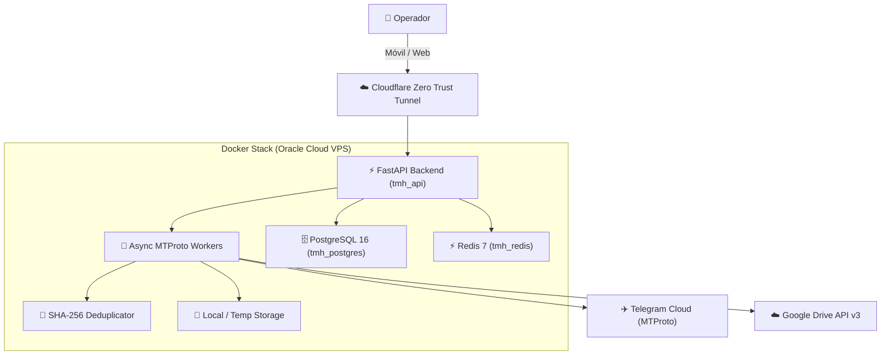

<div align="center">

# ⚡ TELEGRAM MEDIA HUB v3.0 (Cloud & Mobile)
### 🚀 Turbo Downloader Masivo • Inteligencia OSINT 360° • App Móvil Android • Google Drive Cloud Sync


**Creador & Arquitecto:** [Luciano Gutiérrez (`@lukgtz`)](https://github.com/lukgtz) • *Salta, Argentina*

---

</div>

## 🌐 1. Visión General de la Plataforma

**Telegram Media Hub v3.0** es una plataforma distribuida de grado empresarial para la extracción masiva de contenido multimedia, análisis de inteligencia en fuentes abiertas (OSINT) y sincronización en la nube desde canales, supergrupos y foros de Telegram.

Diseñada para operar **24/7 de forma autónoma en servidores en la nube (VPS)** con una **Consola Web Táctica (Cyber OLED)** y una **Aplicación Móvil Nativa (Flutter Android)** conectadas mediante **WebSockets en Tiempo Real**.

---

## 📱 2. Características de la App Móvil (Android)

- **⚡ Búsqueda 360° Ultra Rápida:** Búsqueda indexada en milisegundos con despaquetado de álbumes multimedia completos y filtrado por Fotos, Videos y Documentos.
- **🔍 Inspector OSINT Interactivo:** Panel táctico deslizable (`ModalBottomSheet`) con desglose de medios, botón de descarga directa de canales y explorador de Topics de foros con casillas de verificación (`checkboxes`).
- **📋 Copia Rápida de IDs:** Copia en 1 toque de IDs negativos (`-100...`) y enlaces al portapapeles.
- **⚡ Vinculación Táctica por QR & PIN:** Inicia sesión en el celular en 1 segundo escaneando el Código QR o ingresando un PIN de 6 caracteres desde el panel Web.
- **🟢 Telemetría en Vivo:** Velocidad instantánea en MB/s, ETA estimado, barra de progreso y descarga directa de paquetes ZIP al almacenamiento del celular.

---

## 🏗️ 3. Arquitectura del Sistema



---

## 🚀 4. Despliegue Rápido con Docker Compose

### Prerrequisitos
- Docker Engine & Docker Compose instalados.
- Cuenta de Telegram (API ID y API Hash de [my.telegram.org](https://my.telegram.org)).

### Pasos de Instalación

1. **Clonar el Repositorio:**
   ```bash
   git clone https://github.com/lukgtz/Telegram-Media-Hub-v3.0-Cloud-Mobile.git
   cd Telegram-Media-Hub-v3.0-Cloud-Mobile
   ```

2. **Configurar Variables de Entorno:**
   ```bash
   cp .env.example .env
   # Editar .env con tu TELEGRAM_API_ID, TELEGRAM_API_HASH y SECRET_KEY
   ```

3. **Iniciar los Servicios en Segundo Plano:**
   ```bash
   docker-compose up -d --build
   ```

4. **Acceso:**
   - 🌐 **Panel Web:** `http://localhost:8000`
   - 📚 **Documentación API Swagger:** `http://localhost:8000/docs`
   - 📱 **Descarga de APK Android:** `http://localhost:8000/download-apk`

---

## 📱 5. Compilación de la App Móvil (Flutter)

```bash
cd flutter_app
flutter pub get
flutter build apk --release
```
*El binario generado se ubicará en `flutter_app/build/app/outputs/flutter-apk/app-release.apk`.*

---

## 📚 6. Estructura de Documentación Técnica

- [`agent.md`](agent.md): Especificación del agente de IA, rol y reglas inmutables.
- [`specs/01-requerimientos.md`](specs/01-requerimientos.md): Requerimientos funcionales, no funcionales y límites de alcance.
- [`specs/02-flujo-usuario.md`](specs/02-flujo-usuario.md): Diagramas de secuencia y recorrido del usuario.
- [`specs/03-arquitectura.md`](specs/03-arquitectura.md): Topología de contenedores, microservicios y capas de almacenamiento.
- [`specs/04-modelo-datos.md`](specs/04-modelo-datos.md): Esquema de base de datos relacional y contratos de endpoints.
- [`docs/DECISIONS.md`](docs/DECISIONS.md): Registro histórico de Decisiones de Arquitectura (ADR-001 a ADR-007).
- [`docs/STATE.md`](docs/STATE.md): Estado actual del proyecto y verificación de hitos.

---

## 👨‍💻 Autor & Créditos

Desarrollado y mantenido por **Luciano Gutiérrez (`@lukgtz`)**  
📍 Salta, Argentina • 2026

*Diseñado para fines educativos, investigación de seguridad y gestión forense de multimedia.*
