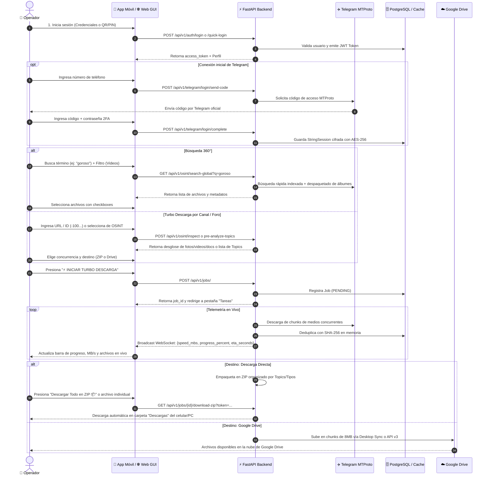

# 🧭 02 — Flujo de Usuario (User Journey)

> **Proyecto:** Telegram Media Hub v3.0 & OSINT Matrix  
> **Versión:** 3.0.0

---

## 🌊 Flujo Integral Paso a Paso

---

## 📱 Descripción de Pantallas Principales

1. **Pantalla de Autenticación & Conexión:**
   - Permite login clásico (Email/Contraseña), registro de nuevas cuentas, o escaneo de Código QR / PIN táctico generado en la Web.
   - Asistente de vinculación de cuenta de Telegram (Teléfono -> Código -> 2FA Password).

2. **Pestaña 1 — 🔍 BÚSQUEDA 360°:**
   - Barra de búsqueda global con selector de filtros (Todos, Videos, Fotos, Documentos).
   - Tarjetas interactivas con nombre, tamaño en MB, chat de origen, tipo de archivo y badge de procedencia (Directo, Álbum, Topic).
   - Botón de descarga individual directa al teléfono o descarga masiva seleccionada en ZIP.

3. **Pestaña 2 — ⚡ TURBO DESCARGAS:**
   - Entrada para URLs públicas, privadas (`t.me/c/...`), IDs numéricos (`-100...`) o nombres de usuario.
   - Selector de concurrencia deslizante (1 a 20 hilos simultáneos).
   - Selector de destino (Descarga Directa en Servidor/ZIP o Google Drive).
   - Botón de pre-análisis de temas de foro con checkboxes interactivos.

4. **Pestaña 3 — ⏱️ TAREAS & TELEMETRÍA EN VIVO:**
   - Tarjeta de telemetría en tiempo real: Velocidad en MB/s, porcentaje de progreso, ETA en minutos, conteo de deduplicación SHA-256.
   - Botones de control operativo: **Pausar**, **Reanudar**, **Cancelar** y **Descargar Todo en ZIP 📦**.
   - Lista interactiva de archivos procesados con estado, hash SHA-256 y botón de descarga individual.

5. **Pestaña 4 — 🕵️ OSINT RECON MATRIX:**
   - Lista automática de canales, grupos y foros del usuario con sus IDs formateados (`-100...`).
   - Botones rápidos de 1-tap para copiar ID y enlaces al portapapeles.
   - Botón **"Inspeccionar"** que despliega el panel táctico inferior con conteo de fotos/videos/docs, desglose de topics y botón de descarga directa.

6. **Pestaña 5 — ⚙️ AJUSTES & CONEXIONES:**
   - Estado de conexión con Telegram (Conectado / Desconectado).
   - Estado de vinculación con Google Drive.
   - Métricas globales de ahorro de almacenamiento por deduplicación SHA-256.
   - Generador de Código QR y PIN para vincular la App Móvil.
