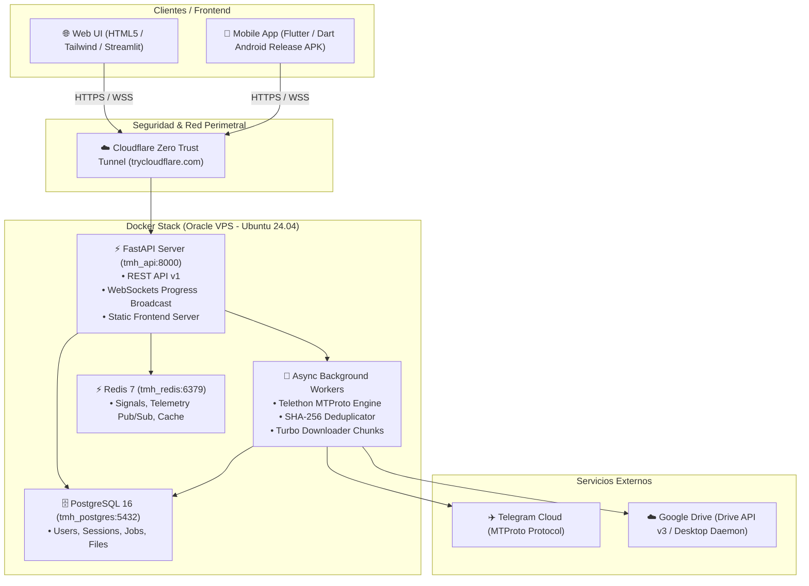

# 🏗️ 03 — Arquitectura del Sistema

> **Proyecto:** Telegram Media Hub v3.0 & OSINT Matrix  
> **Versión:** 3.0.0

---

## 📐 Topología de Servicios & Microcontenedores

---

## 🧩 Componentes del Backend

1. **API Router & Endpoints (`app/api/endpoints/`):**
   - `auth.py`: Autenticación JWT, registro, login rápido por QR/PIN, reset de contraseña.
   - `telegram.py`: Flujo de login MTProto (código, contraseña 2FA) y desconexión.
   - `jobs.py`: Creación de tareas, listado, control de señales (Pause/Resume/Cancel), descarga de ZIPs y archivos individuales.
   - `osint.py`: Inspección de chats (`/info`), listado de diálogos (`/my-chats`), pre-análisis de temas y búsqueda global 360°.
   - `drive.py`: Flujo OAuth2 de Google Drive y gestión de carpetas remotas.

2. **Servicios Core (`app/services/`):**
   - `telegram_service.py`: Instanciación de clientes `TelegramClient(StringSession)`, resolución segura de entidades, búsqueda indexada de mensajes y despaquetado de álbumes.
   - `dedup_service.py`: Motor de deduplicación criptográfica SHA-256 por bloques de 64KB.
   - `drive_service.py`: Manejo de tokens y subida en chunks reanudables de 64MB/128MB.

3. **Workers & Telemetría (`app/workers/`):**
   - `tasks.py`: Pipeline principal de descarga asíncrona (`execute_download_job`) con semáforos de concurrencia (`asyncio.Semaphore`).
   - `progress.py`: Gestor de conexiones WebSocket (`ConnectionManager`) para emisión de telemetría reactiva hacia los clientes.

---

## 💾 Capas de Almacenamiento

| Ruta / Volumen | Tipo | Propósito |
| :--- | :--- | :--- |
| `app/downloads_storage/` | Volumen Local Persistente | Archivos descargados organizados por `user_{id}/job_{id}/` |
| `app/temp_storage/` | Almacenamiento Temporal | Empaquetado dinámico de archivos `.zip` y descarga al vuelo |
| `postgres_data` | Volumen Docker | Base de datos relacional PostgreSQL 16 |
| `redis_data` | Volumen Docker | Persistencia AOF/RDB para Redis 7 |
