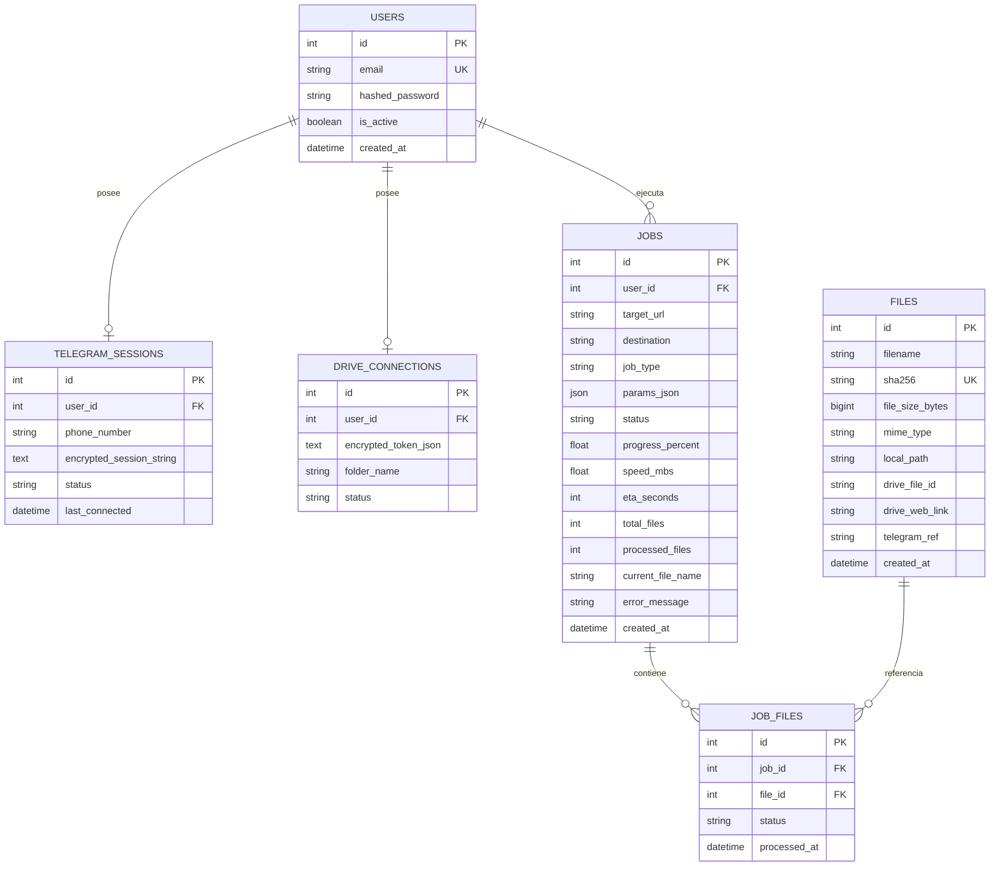

# 🗄️ 04 — Modelo de Datos y Contratos de API

> **Proyecto:** Telegram Media Hub v3.0 & OSINT Matrix  
> **Versión:** 3.0.0

---

## 🏛️ Esquema de Base de Datos (PostgreSQL 16)



---

## 📡 Contratos de Interfaz (API Endpoints & Payloads)

### 1. Autenticación (`/api/v1/auth`)
- `POST /login`: `username` (email), `password` -> `{ access_token, token_type }`
- `POST /register`: `{ email, password }` -> `{ access_token, token_type }`
- `POST /quick-login`: `{ code: "TMH-XXXX" }` -> `{ access_token, token_type }`
- `GET /me`: Header `Authorization: Bearer <token>` -> `{ id, email, is_active, telegram_connected, drive_connected }`

### 2. Creación de Tareas (`/api/v1/jobs`)
- `POST /`:
```json
{
  "target_url": "-1003833777544",
  "destination": "DIRECT_DOWNLOAD",
  "job_type": "BATCH_CHANNEL",
  "selected_topic_ids": [8088, 5516],
  "concurrency": 10,
  "invert_order": false,
  "limit_messages": 500,
  "media_filter": "ALL"
}
```
- `GET /{job_id}/download-zip?token=<token>`: Descarga el archivo ZIP generado.
- `GET /download-file/{file_id}?token=<token>`: Descarga el archivo físico individual.

### 3. Búsqueda 360° & OSINT (`/api/v1/osint`)
- `GET /search-global?q=termino&filter=ALL&limit=150`:
```json
{
  "summary": {
    "total_found": 23,
    "total_size_mb": 142.5,
    "videos": 12,
    "photos": 8,
    "documents": 3
  },
  "results": [
    {
      "msg_id": 8558,
      "chat_id": -1003833777544,
      "chat_title": "Mi Canal VIP",
      "sender_name": "Admin",
      "date": "2026-09-10 13:40",
      "text": "Video exclusivo",
      "has_media": true,
      "media_type": "VIDEO",
      "filename": "video_8558.mp4",
      "size_mb": 15.4,
      "origin": "DIRECT_MATCH"
    }
  ]
}
```

### 4. Mensajes WebSocket (`/ws/progress/{user_id}`)
- Formato del mensaje transmitido al cliente en tiempo real:
```json
{
  "job_id": 8,
  "status": "RUNNING",
  "progress": 0.65,
  "speed_mbs": 8.4,
  "eta_seconds": 24,
  "total_files": 23,
  "processed_files": 15,
  "current_file": "video_8558.mp4",
  "dedup_count": 3
}
```
